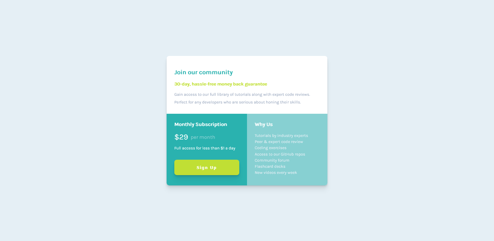

# Frontend Mentor - Single Price Grid Component Solution

This is a solution to the [Single Price grid Component challenge on Frontend Mentor](https://www.frontendmentor.io/challenges/single-price-grid-component-5ce41129d0ff452fec5abbbc). Frontend Mentor challenges help you improve your coding skills by building realistic projects.

## Table of contents

- [Overview](#overview)
  - [The challenge](#the-challenge)
  - [Screenshot](#screenshot)
  - [Links](#links)
  - [Built with](#built-with)
- [Author](#author)

## Overview

### The challenge

Users should be able to:

- View the optimal layout for the component depending on their device's screen size.
- See a hover state on desktop for the Sign Up call-to-action.

### Screenshot

### Links

- Solution URL: [Here](https://your-solution-url.com)
- Live Site URL: [Here](https://likelytwitchdollop.github.io/single-price-grid-component/)

### Built with

HTML5 + CSS | Flexbx | CSS Grid using a mobile-first workflow.

## Author

- Frontend Mentor - [@likelytwitchdollop](https://www.frontendmentor.io/profile/likelytwitchdollop)
